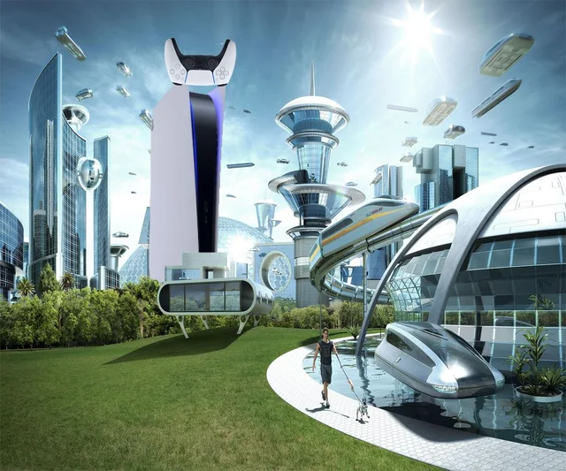

# TLADS - Think Like a Data Scientist



## Overview

**TLADS** (Think Like a Data Scientist) is an interactive workshop designed to give participants hands-on experience with data science methodologies and approaches. This project demonstrates the fundamental differences between a software engineer's "Builder's Mindset" and a data scientist's "Experimenter's Mindset" through practical exercises using real-world datasets.

## Author

**Stephen Webb** - Workshop Creator and Data Science Instructor

## Workshop Objectives

By the end of this workshop, participants will:
- Understand how data scientists approach open-ended problems
- Gain first-hand experience tackling exploratory data analysis
- Learn the difference between engineering and scientific problem-solving approaches
- Apply data visualization techniques using modern Python libraries
- Navigate common pitfalls in data science projects

## Project Structure

```
TLADS/
├── .devcontainer/
│   ├── devcontainer.json          # Development container configuration
│   └── Dockerfile                 # Container build instructions
├── tlads_ipynb/                   # Main workshop materials
│   ├── tlads_nb.ipynb            # Primary workshop notebook (framework)
│   ├── data_maturity.jpeg        # Data maturity ladder diagram
│   ├── fremont-bridge-bicycle-counts-exercise.csv  # Bicycle count dataset
│   ├── NOAA_Seattle-data.csv     # Weather data from NOAA
│   ├── xkcd.png                  # XKCD comic illustration
│   ├── future-city.jpg           # Workshop imagery
│   ├── future-city.webp          # Workshop imagery (web format)
│   ├── innocent-x.png            # Workshop imagery
│   └── rubegoldberg.jpg          # Workshop imagery
├── dash_app.py                   # Sample Dash application for reference
├── docker-compose.yml            # Docker composition for easy setup
├── requirements.txt              # Python dependencies
└── README.md                     # This file
```

## Datasets Included

### 1. Fremont Bridge Bicycle Counts
- **Source**: Seattle Department of Transportation
- **Description**: Hourly bicycle counts from sensors on the Fremont Bridge
- **Columns**:
  - `Date`: Timestamp of measurement
  - `Fremont Bridge Total`: Total bicycles counted
  - `Fremont Bridge East Sidewalk`: Eastbound bicycle count
  - `Fremont Bridge West Sidewalk`: Westbound bicycle count

### 2. NOAA Seattle Weather Data
- **Source**: National Oceanic and Atmospheric Administration
- **Description**: Historical weather observations for Seattle area

## Getting Started

### Prerequisites

- Docker and VS Code with Dev Containers extension, OR
- Python 3.11+ with pip

### Option 1: Using Dev Container (Recommended)

1. **Clone the repository** and open in VS Code
2. **Reopen in Container** when prompted (or use Command Palette: "Dev Containers: Reopen in Container")
3. **Wait for setup** - dependencies will be installed automatically from `requirements.txt`
4. **Open** `tlads_ipynb/tlads_nb.ipynb` and start the workshop!

### Option 2: Using Docker Compose

```bash
# Clone and navigate to the project
git clone <repository-url>
cd TLADS

# Start the development environment
docker-compose up

# Access Jupyter at http://localhost:8888
```

### Option 3: Local Python Environment

1. **Create a virtual environment**:
   ```bash
   python -m venv tlads-env
   source tlads-env/bin/activate  # On Windows: tlads-env\\Scripts\\activate
   ```

2. **Install dependencies**:
   ```bash
   pip install -r requirements.txt
   ```

3. **Launch Jupyter**:
   ```bash
   jupyter notebook tlads_ipynb/tlads_nb.ipynb
   ```

### Option 4: Try the Sample Dash App

Once your environment is set up, you can run the sample dashboard:

```bash
python dash_app.py
```

Then visit `http://localhost:8050` to see an interactive dashboard example.

## Key Python Libraries Used

- **pandas** (~2.2.3): Data manipulation and analysis
- **matplotlib** (~3.10.0): Static plotting and visualization
- **plotly** (~5.17.0): Interactive visualizations and dashboards
- **dash** (~2.17.0): Web applications for Python analytics
- **scikit-learn** (~1.5.0): Machine learning library
- **scipy** (~1.14.1): Scientific computing
- **seaborn** (~0.13.0): Statistical data visualization
- **jupyter** (~1.0.0): Interactive notebook environment

## License

This educational material is provided for workshop and learning purposes. Please respect the data sources and attribution requirements.

---

*"In science, if you know what you are doing, you should not be doing it. In engineering, if you do not know what you are doing, you should not be doing it."* - Richard Hamming

Happy Data Science! 🔬📊🐍
